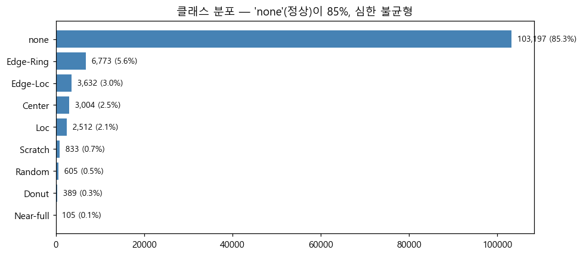
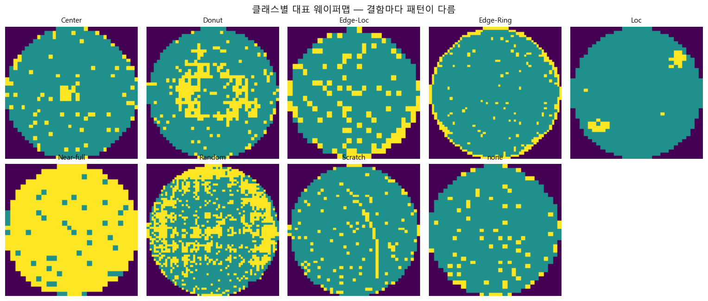
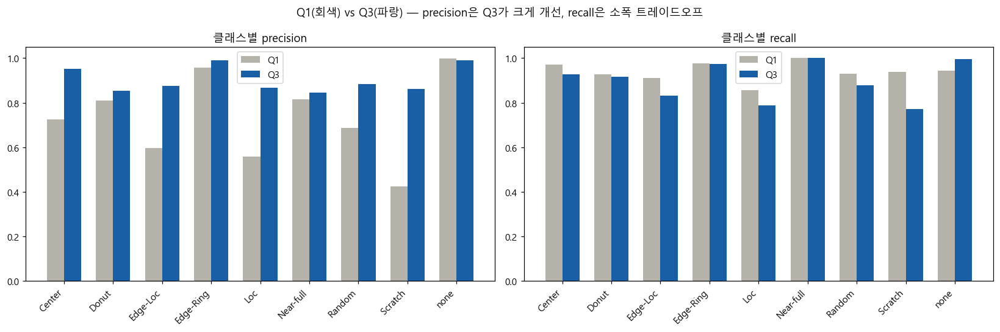
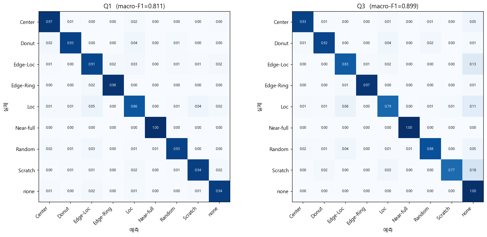
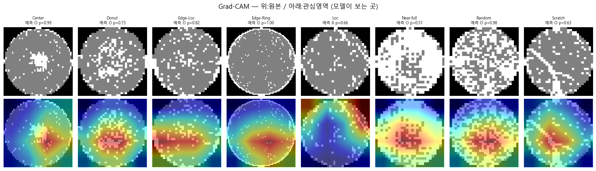
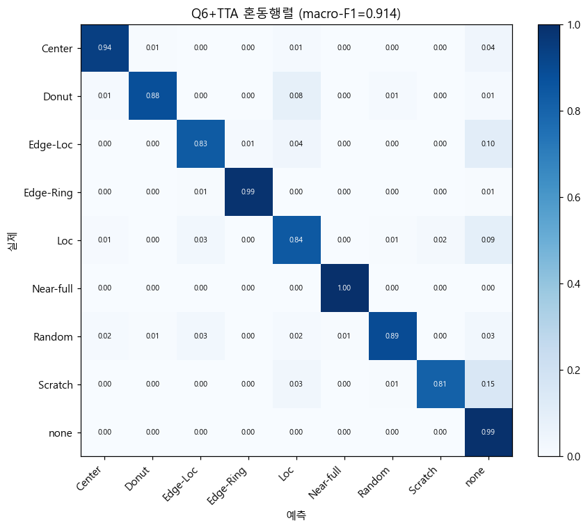

# 반도체 웨이퍼 맵 결함 패턴 분류 및 공정 원인 추론

딥러닝으로 반도체 웨이퍼 맵의 결함 패턴을 분류하고, 결함을 유발한 공정 원인까지 추론하여 조치 가이드를 제시하는 프로젝트.

> 웨이퍼 맵 입력 → **결함 종류(9종) 분류** → **Grad-CAM 근거 시각화** → **공정 원인 추론** → **조치 가이드 제시**

---

## 주요 결과

| 모델 | 태스크 | macro-F1 | accuracy |
|---|---|---|---|
| 기준 (ResNet18 전이학습) | 결함 분류 | 0.811 | 0.943 |
| 개선 (Focal Loss + 균형 가중치) | 결함 분류 | 0.899 | 0.981 |
| **최종 (50ep 장기학습 + TTA)** | 결함 분류 | **0.914** | **0.982** |
| 멀티태스크 | 결함 분류 | 0.890 | 0.979 |
| 멀티태스크 | 공정 원인 추론 | **0.896** | 0.980 |

정상(none) 클래스가 전체의 85%인 심한 불균형 환경에서, 단순 정확도가 아닌 **macro-F1**과 **클래스별 precision/recall**을 핵심 지표로 사용했다. 불균형 대응 기법으로 가장 약했던 Scratch 클래스의 precision이 0.42 → 0.86으로 개선되었고, 장기 학습과 TTA를 더해 최종 결함 분류 macro-F1 **0.914**를 달성했다.

---

## 데이터셋과 불균형

공개 벤치마크 **WM-811K** (811,457장) 중 라벨이 있는 172,930장을 사용했다. 웨이퍼 맵은 0(배경)·1(정상 다이)·2(불량 다이) 값을 가지는 2차원 격자다.





---

## 방법론

- **모델**: ImageNet 사전학습 ResNet18을 전이학습. 마지막 분류층을 9개 클래스로 교체 후 파인튜닝.
- **불균형 대응**: 1차에서 inverse-frequency 가중치를 사용했으나 오탐이 많았다. 2차에서 **Focal Loss(γ=2) + class-balanced 가중치(effective number)** 로 오탐을 크게 줄였다.
- **설명가능성**: **Grad-CAM**으로 모델이 실제 결함 영역을 보고 판단하는지 검증.
- **공정 원인 추론**: 백본을 공유하는 **멀티태스크 구조**(결함 헤드 + 원인 헤드). 원인 라벨은 결함→원인 도메인 매핑(`configs/mappings/defect_to_cause.yaml`)에서 생성.
- **성능 향상**: 50에폭 장기 학습(조기종료) + **TTA**(회전·반전 8가지 예측 평균)로 결함 분류 macro-F1을 0.899 → 0.914로 개선.

---

## 결과 시각화

### 불균형 대응 전후 비교 (precision / recall)



### 혼동행렬 비교



### Grad-CAM — 모델이 주목한 영역



### 최종 모델 혼동행렬 (50ep + TTA, macro-F1 0.914)



---

## 프로젝트 구조

```
project/
├── README.md                       이 문서
├── requirements.txt
├── configs/
│   ├── default.yaml                학습/데이터 설정
│   └── mappings/
│       └── defect_to_cause.yaml    결함 → 공정 원인 매핑 + 조치 가이드
├── notebooks/
│   ├── 01_eda.ipynb                탐색적 분석, 라벨 정규화
│   ├── 02_preprocessing.ipynb      리사이즈·분할 → npz 저장
│   ├── 03_baseline_model.ipynb     기준 모델 (ResNet18 전이학습)
│   ├── 04_gradcam_eval.ipynb       Grad-CAM 분석 및 추론 데모
│   ├── 05_imbalance_focal.ipynb    개선 모델 (Focal Loss + 균형 가중치)
│   ├── 06_results_summary.ipynb    데이터~결과 전 과정 종합
│   ├── 07_multitask_cause.ipynb    멀티태스크 (결함 + 공정 원인)
│   └── 08_longtrain_tta.ipynb      장기학습 + TTA (최종 모델)
├── app/
│   └── streamlit_app.py            진단 데모 웹앱
├── utils/
│   └── korean_font.py              matplotlib 한글 폰트 유틸
└── docs/
    ├── REPORT.md                   상세 보고서
    └── images/                     결과 그림
```

---

## 실행 방법

### 1. 환경 설정

```bash
pip install -r requirements.txt
```

> NVIDIA GPU 사용 시, GPU 아키텍처에 맞는 CUDA 빌드 PyTorch를 설치한다.
> 예) RTX 50 시리즈(Blackwell): `pip install torch torchvision --index-url https://download.pytorch.org/whl/cu128`

### 2. 데이터 준비

WM-811K(`LSWMD.pkl`)를 `data/`에 두고 아래 노트북을 순서대로 실행해 전처리 결과(`data/processed/*.npz`)를 생성한다.

```
notebooks/01_eda.ipynb  →  notebooks/02_preprocessing.ipynb
```

### 3. 모델 학습 및 분석

```
03_baseline_model.ipynb  →  04_gradcam_eval.ipynb  →  05_imbalance_focal.ipynb
06_results_summary.ipynb  →  07_multitask_cause.ipynb  →  08_longtrain_tta.ipynb
```

> `08_longtrain_tta.ipynb`가 최종 결함 분류 모델(50에폭 + TTA, macro-F1 0.914)이다.

### 4. 진단 데모 실행

```bash
streamlit run app/streamlit_app.py
```

웨이퍼 맵을 선택하거나 업로드하면 결함 종류·공정 원인·조치 가이드·Grad-CAM 근거가 표시된다.

---

## 한계 및 향후 계획

-